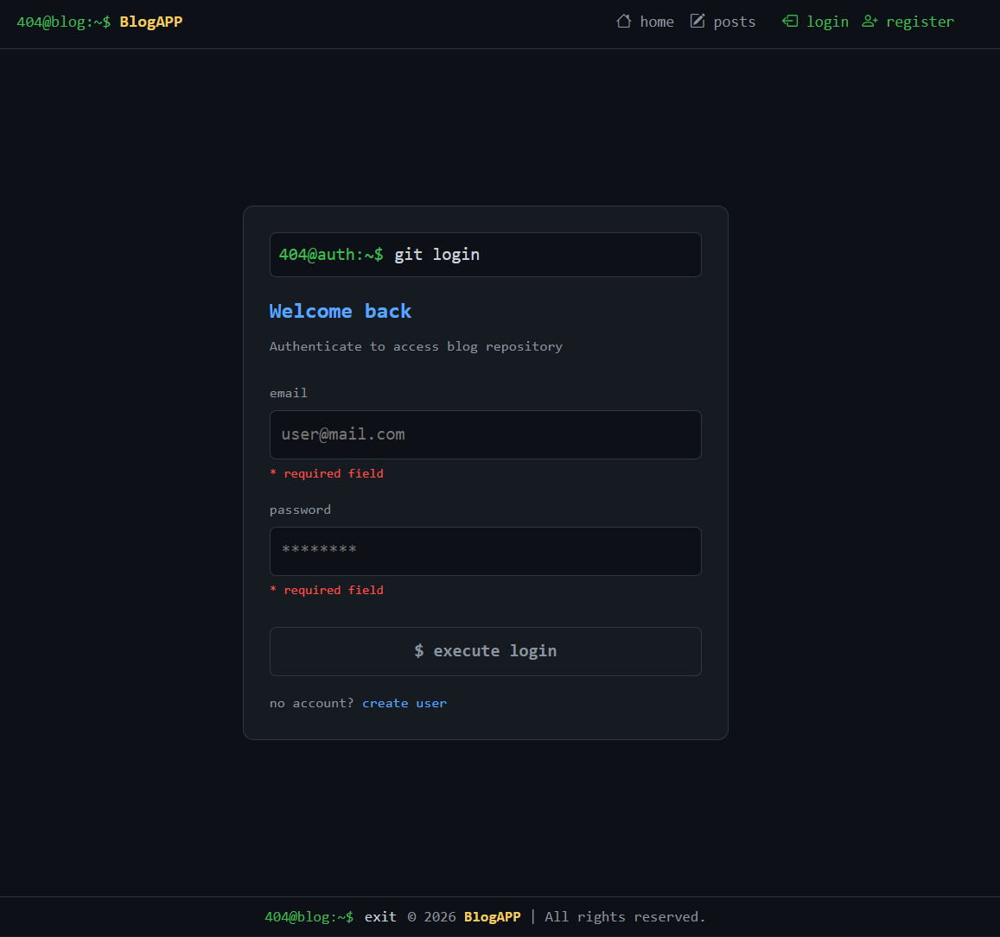
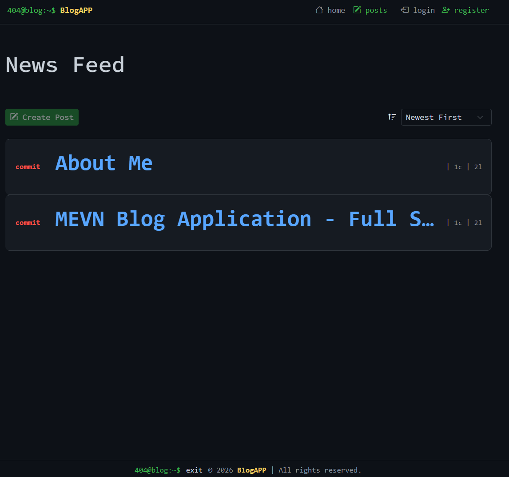
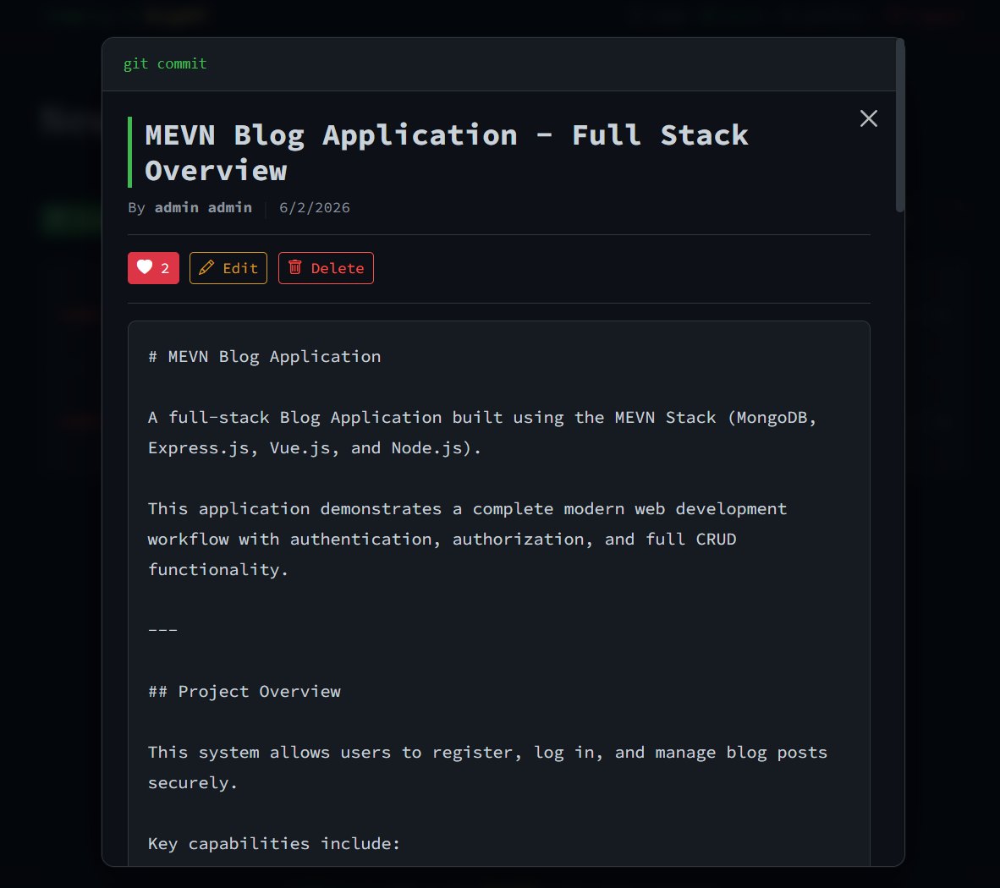
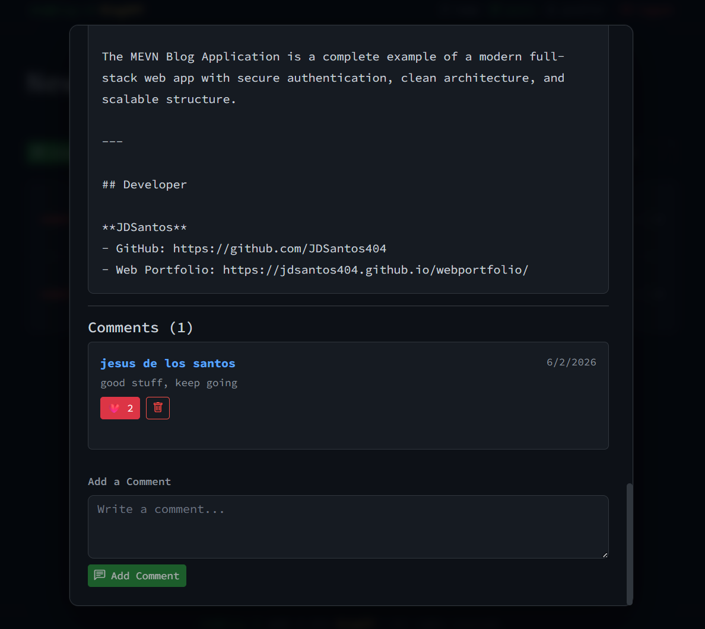
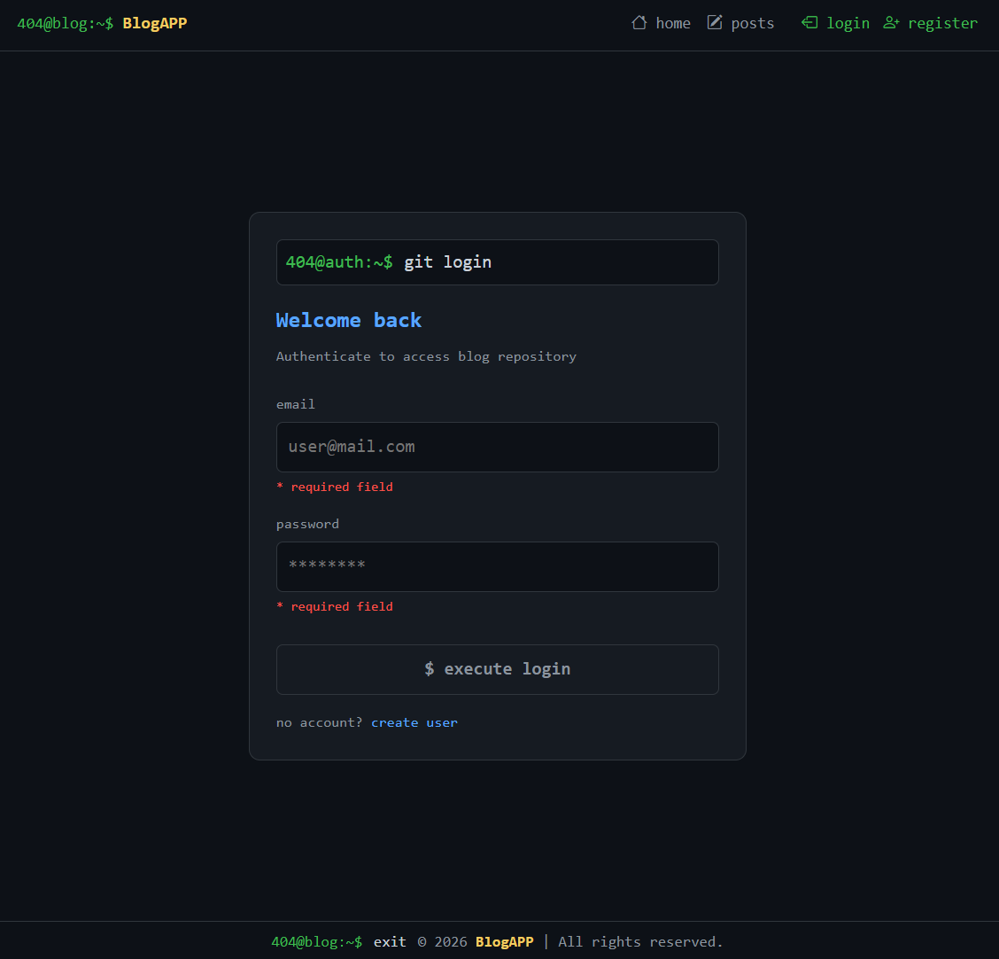
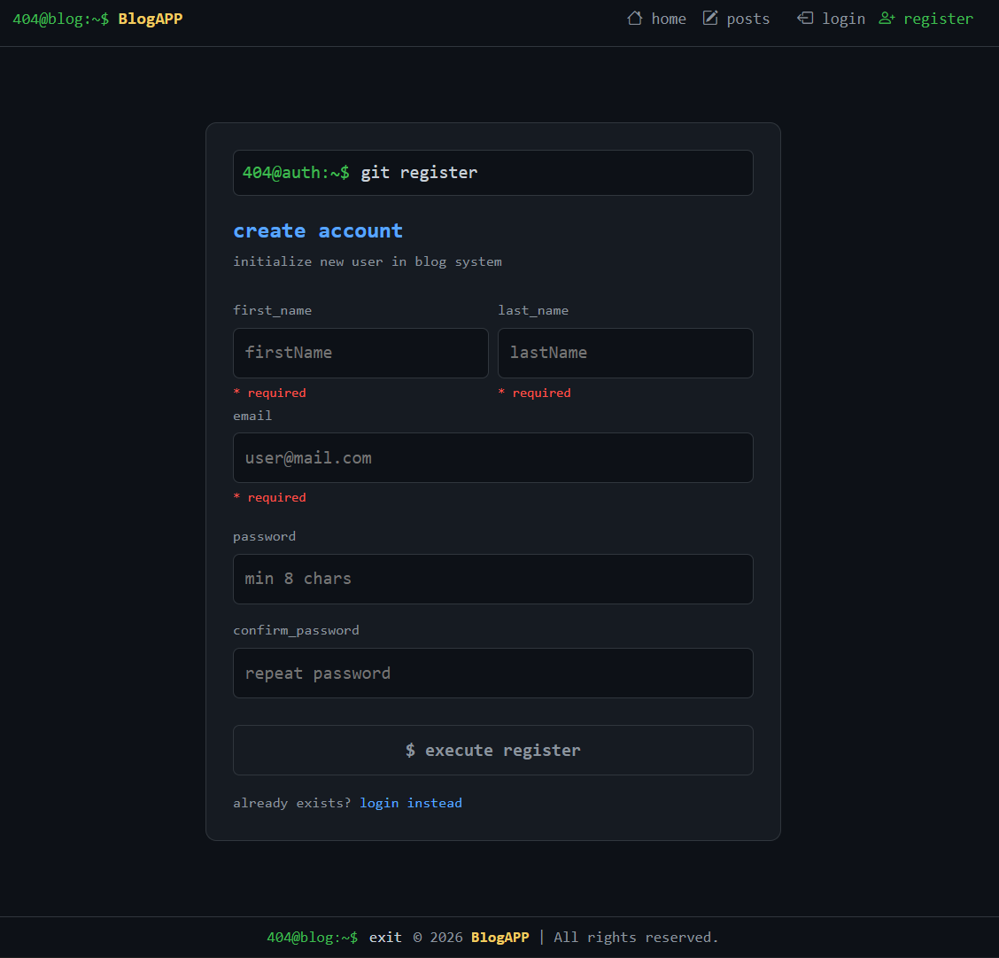
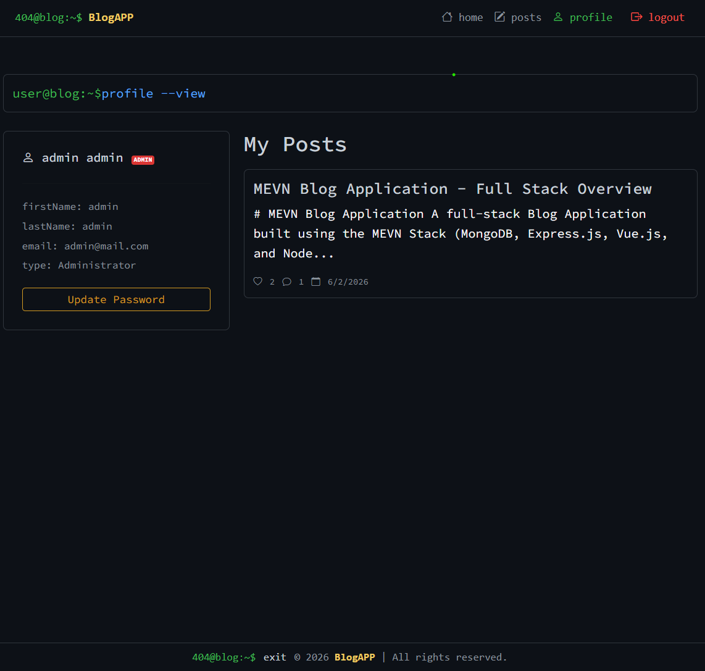

# 404 BlogApp Terminal-Themed Frontend

A frontend-only blogging application built using **Vue.js** with a unique **terminal-style CLI interface design**. This application simulates a retro command-line environment inside the browser for browsing, creating, and interacting with blog posts.

---

## Project Overview

This project transforms a traditional blog UI into a **terminal-inspired experience**, where users interact with the system through a simulated shell interface.

### Core Architecture
* **Terminal UI:** Simulated shell using a `404@blog:~$` prompt system.
* **CLI Navigation:** Command-inspired routing mapped directly to app pages.
* **State Management:** Authentication-based session persistence.
* **Interactivity:** Full blog post interaction system (likes & comments).
* **System Logs:** Toast-based system feedback (e.g., `login successful`, `Post liked`).
* **Tooling:** Highly responsive frontend layout powered by Vite.

---

## Tech Stack

### Frontend (`client/`)
* **Framework:** Vue.js
* **Routing:** Vue Router
* **Build Tool:** Vite
* **HTTP Client:** Axios (for API communication)
* **Styling:** Custom terminal-inspired CSS theme
* **Design Assets:** Monospace typography + SVG/Nerd Font icons

### Backend (`server/`)
* **Runtime:** Node.js
* **Framework:** Express
* **Database:** MongoDB (Mongoose ODM)
* **Authentication:** JWT (JSON Web Token) + middleware-based route protection
* **Architecture Style:** MVC (Models, Controllers, Routes separation)
* **API Type:** RESTful API
* **Security:** Password hashing (bcrypt) + protected routes via auth middleware
* **Environment Management:** dotenv for configuration variables

---

## Features & Commands

### Terminal UI Experience
The application uses a simulated terminal shell to initialize and view pages:

```bash
404@blog:~$ run homepage
```

### CLI Navigation System
Instead of using traditional navigation menus, users type or trigger CLI-style commands to load views:
* `home` \(\rightarrow\) Main terminal dashboard and public feed.
* `posts` \(\rightarrow\) Blog creation, management, and publishing workshop.
* `login` \(\rightarrow\) Session authentication interface.
* `register` \(\rightarrow\) New user account creation shell.
* `profile` \(\rightarrow\) User profile settings, information, and history.
* `logout` \(\rightarrow\) Ends user session and clears authentication state.

### Exploration Mode
Public blog content can be accessed directly via the exploration path:

```bash
./explore-posts
```

### Blog Interaction System
Authenticated users gain access to advanced post features:
* Create and publish new blog posts.
* View all published posts in a feed layout.
* Comment on active posts.
* Like posts with instant UI feedback.
* Receive system-style notifications (e.g., `Post liked`).

---

## 🖼️ User Interface Showcase

### 1. Home Page Dashboard


### 2. Posts Management View




### 3. Login Interface


### 4. Register Interface


### 5. Profile Panel



### Home Terminal Layout Element Summary


| Element Identifier | Display Content / Text | Purpose |
| :--- | :--- | :--- |
| **Prompt Title** | `404@blog:~$ run homepage` | Simulates terminal command execution |
| **Brand Header** | `Logo` + `BlogApp` | Application branding |
| **Tagline** | `Discover ideas. Share stories. Connect with creators.` | Platform mission statement |
| **Status Logs** | `login successful`, `Post liked` | System-style feedback console |

---

## API Integration

### Posts Endpoint

#### Fetch All Posts
```http
GET /explore-posts
```

* **Description:** Retrieves all publicly available blog posts for display in the terminal feed interface.
* **Usage:** 
  * Homepage feed rendering
  * Explore mode browsing
  * Public post access

### Authentication System
* **Login Flow:** Users must authenticate to access protected features.
* **Token Storage:** Session-based authentication (JWT-ready structure).
* **State Sync:** Persistent login state across browser refreshes.
* **Route Guards:** Protected routing for post creation and interaction.

---

## 🔑 Demo Credentials

Use these pre-configured accounts to log in and test the application features:

### Admin Account
* **Email:** `admin@mail.com`
* **Password:** `admin123`

### User Account
* **Email:** `user1@mail.com`
* **Password:** `password123`

---

## Installation Guide

### 1. Clone Repository
```bash
git clone <repository-url>
cd 404-blogapp
```

### 2. Install Dependencies
```bash
npm install
```

### 3. Run Development Server
```bash
npm run dev
```
The application will run locally at: `http://localhost:5173`

### 4. Build for Production
```bash
npm run build
```
Generates optimized production-ready files in the `dist/` folder.

### 5. Preview Production Build
```bash
npm run preview
```
Used to test the production build locally before deployment.

---

## Project Structure

```text
404-blogapp/
├── client/                               # Frontend Application
│   ├── pages/
│   │   ├── HomePage.vue                  # Home route view
│   │   ├── LoginPage.vue                 # Login interface
│   │   ├── LogoutPage.vue                # Destroys session
│   │   ├── PostsPage.vue                 # Posts creation and listing
│   │   ├── ProfilePage.vue               # Account metrics dashboard
│   │   └── RegisterPage.vue              # Registration interface
│   ├── router/
│   │   └── index.js                      # Guards and routing config
│   ├── stores/
│   │   └── auth.js                       # State management
│   ├── api.js                            # Axios instance configurations
│   ├── App.vue
│   ├── main.js
│   ├── style.css                         # Core terminal stylesheet
│   ├── index.html
│   ├── vite.config.js
│   ├── .env
│   └── package.json
│
└── server/                               # Backend Application
    ├── controllers/                      # Business logic (posts, users, auth)
    ├── models/                           # MongoDB / Mongoose schemas
    ├── routes/                           # API route definitions
    ├── auth.js                           # Authentication middleware
    ├── index.js                          # Server entry point
    ├── .env
    └── package.json
```

---

## UI Behavior Notes

* **Persistent Prompt:** The terminal prompt header remains visible across all application routes.
* **CLI Mimicry:** Navigation behaves strictly like command execution, omitting standard click transitions.
* **System Toasts:** System feedback alerts appear dynamically at the bottom of the screen:
  ```text
  login successful
  Post liked
  ```
* **Auth Guards:** Global application state strictly locks or unlocks actions based on session status.
* **Responsiveness:** Grid and viewport constraints are optimized across desktop, tablet, and mobile devices.

---

## Future Enhancements

* [ ] Real-time global chat or direct terminal messaging system.
* [ ] Advanced command history cache (arrow-up navigation like a real shell).
* [ ] Integrated global post search and tag filtering system.
* [ ] Infinite scroll architecture for the exploration feed.
* [ ] Extended user profile avatar and bio customization tools.
* [ ] Light, dark, and amber retro color terminal themes.
* [ ] Full Markdown support inside the post creation text editor.

---

## Learning Objectives

This project targets and demonstrates proficiency in:
1. **Vue.js Architecture:** Scaling modern single-page applications.
2. **Component-Based UI:** Structuring reusable custom interactive interface states.
3. **Vue Router Routing:** Deep-linking state properties to text-driven CLI patterns.
4. **API Integration:** Consuming standard REST endpoints inside custom lifecycle hooks.
5. **Session Control:** Managing secure, frontend state engines and tokens.
6. **Unique UX Engineering:** Merging structural retro aesthetics with modern user requirements.

---

## Footer
```bash
404@blog:~\$ exit
```
_© 2026 BlogAPP | All rights reserved._  
Developed as a terminal-themed frontend blog application built with Vue.js for portfolio and learning purposes.
